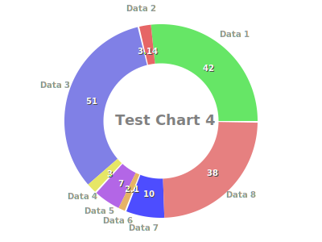

# gestalt-chart
A Java chart generator that aims to make static PNG or animated SVG files.

## Supported charts

### Doughnut


```java
int width = 400;
int height = 300;
String title = "Your chart's super title";
Chart chart = new DoughnutChart(width, height, title);

List<DataPoint> data = new ArrayList();

DataPoint data1 = createDoughnutDataPoint("Data 1", 42);
data.add(data1);

DataPoint data2 = createDoughnutDataPoint("Data 2", 3.14159);
data.add(data2);

DataPoint data3 = createDoughnutDataPoint("Data 3", 51);
data.add(data3);

DataPoint data4 = createDoughnutDataPoint("Data 4", 3);
data.add(data4);

DataPoint data5 = createDoughnutDataPoint("Data 5", 7);
data.add(data5);

DataPoint data6 = createDoughnutDataPoint("Data 6", 2.1);
data.add(data6);

DataPoint data7 = createDoughnutDataPoint("Data 7", 10);
data.add(data7);

DataPoint data8 = createDoughnutDataPoint("Data 8", 38);
data.add(data8);

chart.setData(data);

File destination = new File("YourSvgPathAndName.svg");
SvgEncoder encoder = new SvgEncoder();
```

### Line
Needs documentation.

## Upcoming charts
* Bar;
* Pie;
* Polar.